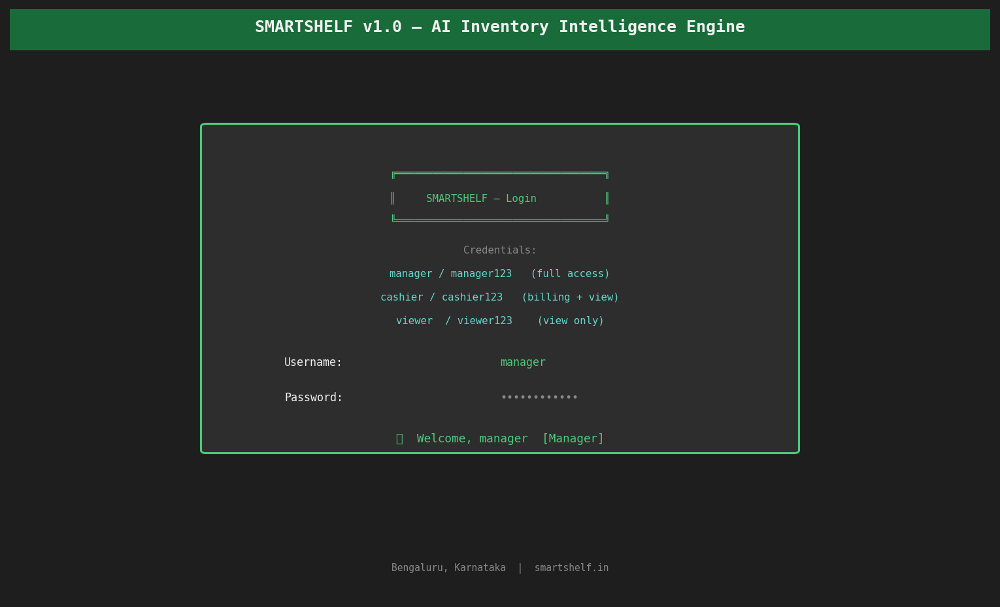
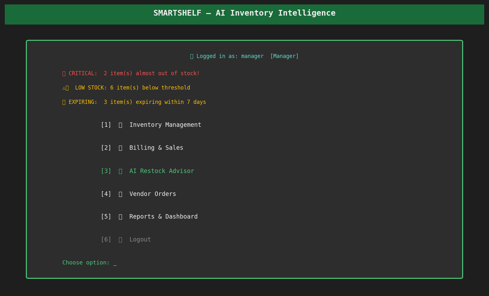
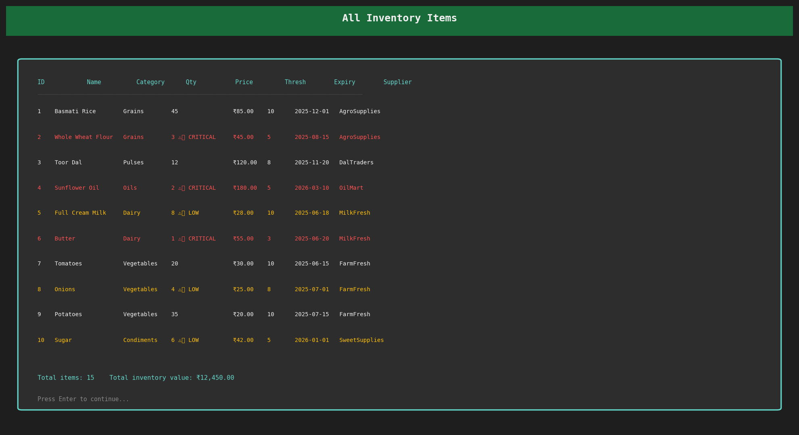
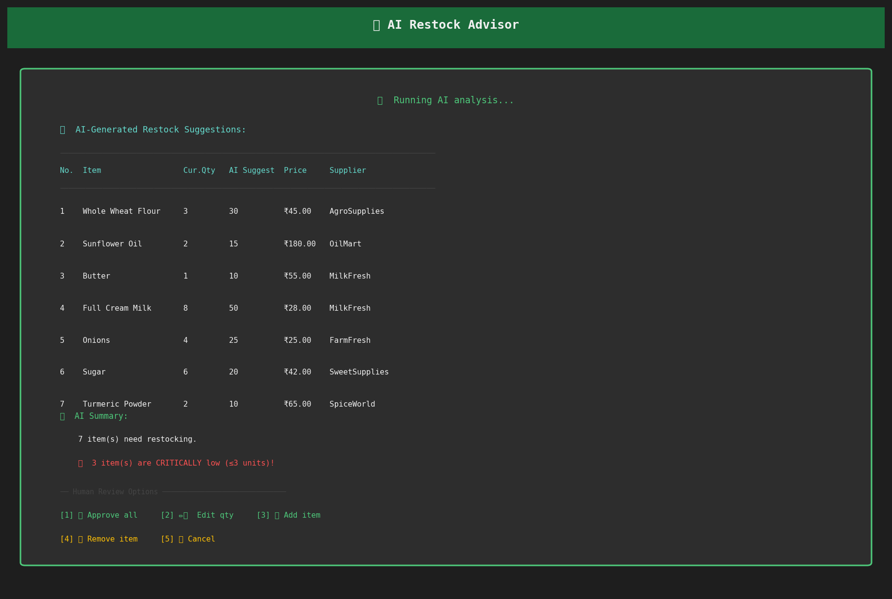
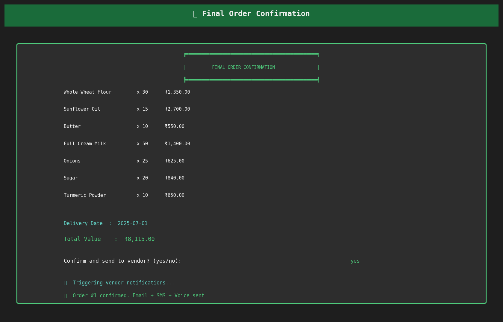
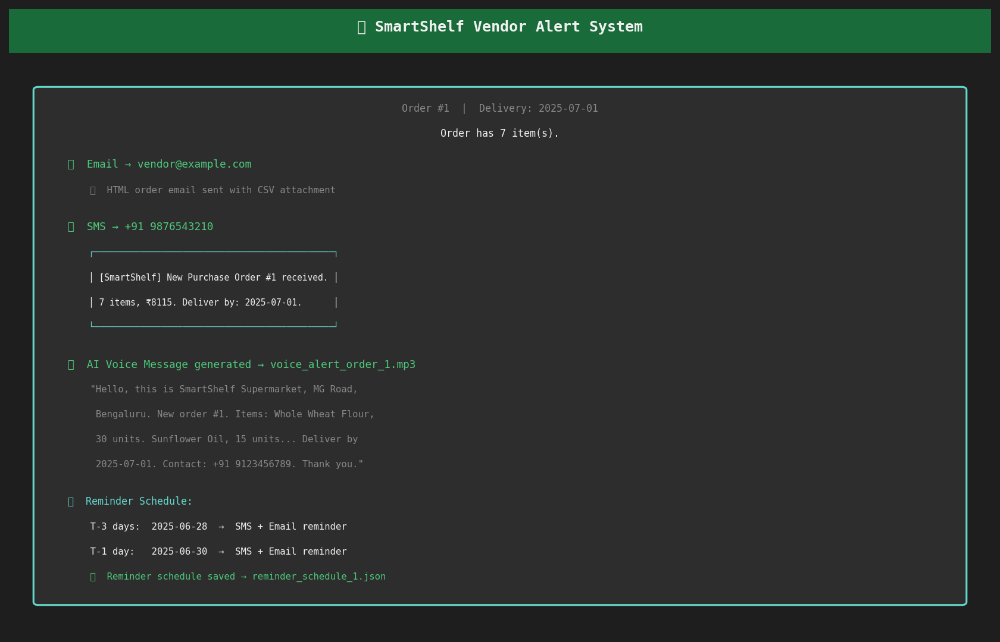
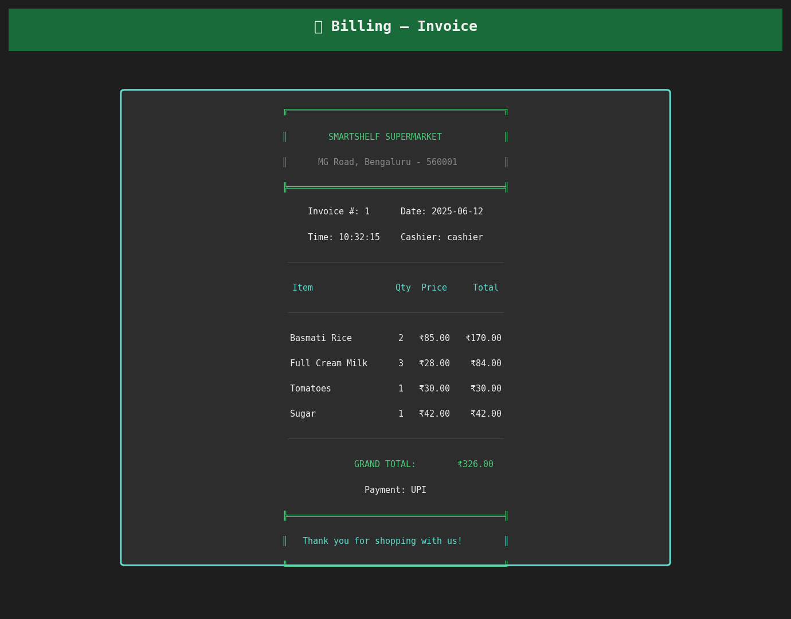
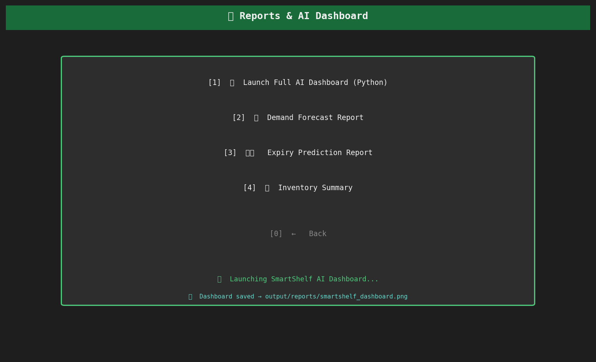

# 🛒 SmartShelf — AI-Driven Supermarket Inventory Intelligence Engine

> **C++ · Python · Machine Learning · AI Alerts · Human-in-the-Loop Design**

SmartShelf is a full-stack intelligent inventory management system for supermarkets.
The C++ engine handles all core operations while a Python ML layer provides AI-powered
demand forecasting, expiry risk prediction, smart restock recommendations, and anomaly
detection. A Human-in-the-Loop approval system ensures AI suggestions are reviewed
by a manager before vendor orders are dispatched.

---

## 🏗️ Architecture

```
┌─────────────────────────────────────────────────────┐
│               C++ CORE ENGINE                       │
│  Role-based login · Stock CRUD · Billing            │
│  Transaction history · Search & filter              │
│  Rule-based alerts · CSV export pipeline            │
└──────────────────────┬──────────────────────────────┘
                       │  CSV data bridge
                       ▼
┌─────────────────────────────────────────────────────┐
│            PYTHON ML / AI LAYER                     │
│  Linear Regression  → Demand Forecasting            │
│  Decision Tree      → Expiry Risk Prediction        │
│  Random Forest      → Smart Restock Quantity        │
│  Isolation Forest   → Anomaly Detection             │
└──────────────────────┬──────────────────────────────┘
                       │
                       ▼
┌─────────────────────────────────────────────────────┐
│         HUMAN-IN-THE-LOOP APPROVAL                  │
│  Manager reviews AI list · Edit qty · Add / Remove  │
│  Set delivery date · Final confirmation             │
└──────────────────────┬──────────────────────────────┘
                       │
                       ▼
┌─────────────────────────────────────────────────────┐
│           VENDOR ALERT SYSTEM                       │
│  📧 Email (Gmail SMTP)                              │
│  📱 SMS (simulated · Twilio-ready)                  │
│  🔊 AI Voice (.mp3 via gTTS)                        │
│  📅 Scheduled reminders (T-3, T-1 days)             │
└─────────────────────────────────────────────────────┘
```

---

## 📸 Screenshots

### 1. Login Screen


### 2. Main Menu — with live alerts


### 3. Inventory Table — color-coded stock levels


### 4. AI Restock Advisor — AI-generated suggestions


### 5. Human Approval — review, edit, confirm order


### 6. Vendor Alert System — Email + SMS + Voice


### 7. Billing Invoice


### 8. Reports & Dashboard Menu


---

## ✨ Features

### C++ Engine
- **Role-based access control** — Manager / Cashier / Viewer
- **Full inventory CRUD** — Add, edit, delete, update quantities
- **Billing module** — Generate formatted invoices, track all transactions
- **Smart alerts** — Critical stock (≤3 units), low stock, expiring items
- **Search & filter** — By name, category, or expiry
- **CSV data pipeline** — Exports to `data/` for Python ML layer

### Python ML / AI Layer
| Model | Algorithm | Purpose |
|---|---|---|
| Demand Forecasting | Linear Regression | Predict next-week sales per item |
| Expiry Risk | Decision Tree | Classify HIGH / MEDIUM / LOW expiry risk |
| Restock Advisor | Random Forest | Optimal order quantities |
| Anomaly Detector | Isolation Forest | Flag unusual stock levels |

### Human-in-the-Loop Restock
1. AI generates suggested restock list automatically
2. Manager sees list on screen with quantities
3. Can approve, edit quantities, add items, or remove items
4. Sets delivery date
5. Confirms — order dispatched to vendor

### Vendor Alert System (100% Free)
- **Email** — Full HTML order with attached CSV via Gmail SMTP
- **SMS** — Simulated in production format (Twilio-ready)
- **AI Voice** — Real `.mp3` generated via Google Text-to-Speech (gTTS)
- **Reminders** — Automated at T-3 days and T-1 day before delivery
- **Delivery confirmation** — Manager marks received → stock updates

### Visual Dashboard
7-chart AI dashboard including:
- Stock levels with risk color coding
- Category distribution
- Demand forecast vs current stock
- Expiry risk heatmap
- Smart restock quantities
- Weekly sales trend
- Inventory value by category

---

## 📁 Project Structure

```
SmartShelf/
├── cpp/
│   ├── main.cpp           ← Entry point + all menus
│   ├── auth.h             ← Role-based authentication
│   ├── inventory.h        ← Stock management + CRUD
│   ├── billing.h          ← Invoice generation + transactions
│   ├── orders.h           ← Vendor order management
│   ├── utils.h            ← Display helpers
│   └── Makefile           ← Build configuration
│
├── python/
│   ├── ml_engine.py       ← All 4 ML models
│   ├── demand_forecast.py ← Demand forecast report
│   ├── expiry_predictor.py← Expiry risk report
│   ├── alert_system.py    ← Email + SMS + Voice alerts
│   ├── dashboard.py       ← Visual dashboard (7 charts)
│   └── requirements.txt   ← Python dependencies
│
├── data/
│   ├── stock.csv                      ← Live inventory (C++ managed)
│   ├── sales.csv                      ← Transaction history
│   ├── orders.csv                     ← Vendor orders
│   ├── vendors.csv                    ← Vendor details
│   ├── demand_forecast.csv            ← ML output
│   ├── expiry_predictions.csv         ← ML output
│   └── restock_recommendations.csv    ← ML output
│
├── output/
│   ├── models/            ← Saved ML models (.pkl)
│   ├── reports/           ← Dashboard charts (.png)
│   ├── screenshots/       ← UI screenshots
│   ├── vendor_order_*.csv ← Per-order export
│   └── voice_alert_*.mp3  ← AI voice messages
│
└── README.md
```

---

## 🚀 Getting Started

### Prerequisites
- **C++17** compiler (g++ recommended)
- **Python 3.8+**
- Gmail account (for email alerts — optional)

### Step 1 — Build & Run C++ Engine

```bash
cd cpp
make
./smartshelf
```

**Default credentials:**
| Username | Password | Role |
|---|---|---|
| manager | manager123 | Full access |
| cashier | cashier123 | Billing + view |
| viewer  | viewer123  | View only |

### Step 2 — Install Python Dependencies

```bash
cd python
pip install -r requirements.txt
```

### Step 3 — Run ML Engine

```bash
python3 ml_engine.py
```

### Step 4 — Launch Dashboard

```bash
python3 dashboard.py
```

### Step 5 — Configure Email Alerts (Optional)

Edit `python/alert_system.py`:
```python
EMAIL_CONFIG = {
    "sender_email":    "your_gmail@gmail.com",
    "sender_password": "your_app_password",   # Gmail App Password
    "vendor_email":    "vendor@example.com",
    ...
}
```

> **Gmail App Password:** Google Account → Security → 2-Step Verification → App Passwords

### Step 6 — Run Alerts Manually

```bash
python3 alert_system.py <order_id> <YYYY-MM-DD>
# Example:
python3 alert_system.py 1 2025-07-01
```

---

## 🤖 ML Models — Technical Details

### 1. Demand Forecasting (Linear Regression)
- **Features:** item_id, week, price, category_encoded
- **Target:** weekly_sales
- **Training data:** 12 weeks of sales history per item
- **Output:** `data/demand_forecast.csv`

### 2. Expiry Risk Prediction (Decision Tree)
- **Features:** days_to_expiry, quantity, price
- **Target:** risk_label (HIGH=2, MEDIUM=1, LOW=0)
- **Depth:** max_depth=5
- **Output:** `data/expiry_predictions.csv`

### 3. Smart Restock Quantity (Random Forest)
- **Features:** quantity, low_stock_threshold, predicted_demand, price
- **Target:** optimal_restock_quantity
- **Estimators:** 100 trees
- **Output:** `data/restock_recommendations.csv`

### 4. Anomaly Detection (Isolation Forest)
- **Features:** quantity, price, low_stock_threshold, reorder_qty, category_enc
- **Contamination:** 10%
- **Output:** `data/anomaly_report.csv`

---

## 🧠 Key Concepts Demonstrated

- Object-Oriented Programming (C++)
- STL containers (vector, map)
- File I/O and CSV data pipeline
- Role-Based Access Control (RBAC)
- Supervised Learning (Linear Regression, Decision Tree, Random Forest)
- Unsupervised Learning (Isolation Forest)
- Feature Engineering
- Model Persistence (joblib .pkl)
- Human-in-the-Loop AI Design
- Text-to-Speech (gTTS)
- Email automation (SMTP)
- Data Visualisation (Matplotlib)

---

## 📄 License

MIT License — free to use and modify.
